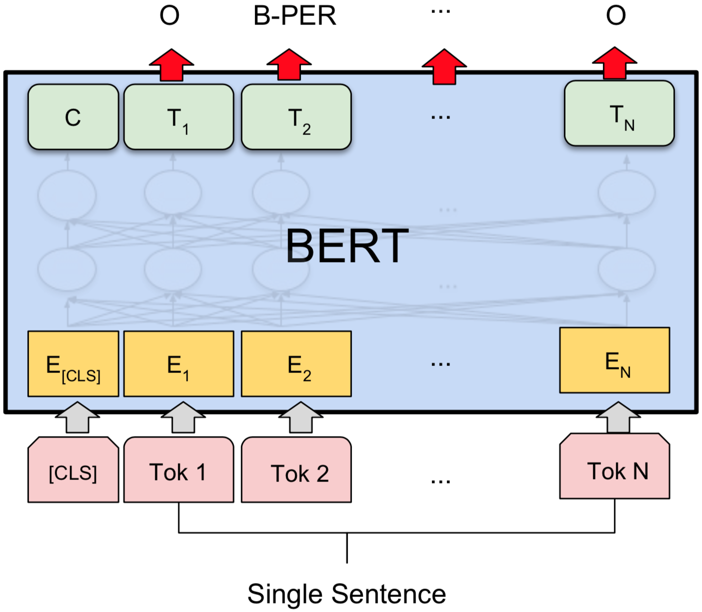

# NER-BERT-pytorch

**PyTorch solution of [Named Entity Recognition](https://en.wikipedia.org/wiki/Named-entity_recognition) task with Google AI's BERT model.**

利用Google AI的BERT模型进行中文命名实体识别任务的PyTorch实现。

Welcome to watch, star or fork.

<div align=center></div>

## MSRA dataset

Here, we take the Chinese NER data MSRA as an example. Of course, the English NER data is also fully applicable.

Named entity recognition task is one of the tasks of the [Third SIGHAN Chinese Language Processing Bakeoff](http://sighan.cs.uchicago.edu/bakeoff2006/), we take the simplified Chinese version of the Microsoft NER dataset as the research object.

### Data Formats

The NER dataset of MSRA consists of training set `data/msra_train_bio` and test set `data/msra_test_bio`, and no validation set is provided. There are 45000 training samples and 3442 test samples, and we will divide them appropriately later.

The dataset contains three types of entities: **Person**, **Organization**, **Location** and **Other**, the corresponding abbreviated tags are `PER`, `ORG` and `LOC` and `O`. 

The format is similar to that of the Co-NLL NER task 2002, adapted for Chinese. The data is presented in two-column format, where the first column consists of the **character** and the second is a **tag**. The tag is specified as follows:

|  Tag  | Meaning                                          |
| :---: | ------------------------------------------------ |
|   O   | Not part of a named entity                       |
| B-PER | Beginning character of a person name             |
| I-PER | Non-beginning character of a person name         |
| B-ORG | Beginning character of an organization name      |
| I-ORG | Non-beginning character of an organization name  |
| B-LOC | Beginning character of a location name           |
| I-LOC | Non-beginning character of a location name       |
| B-GPE | Beginning character of a geopolitical entity     |
| I-GPE | Non-beginning character of a geopolitical entity |

### Dataset patition

We randomly select 3000 samples from the training set as the validation set, and the test set is unchanged. Thus, the dataset distribution is as follows.

|    Dataset     | Number |
| :------------: | :----: |
|  training set  | 42000  |
| validation set |  3000  |
|    test set    |  3442  |

## Requirements

This repo was tested on Python 3.5+ and PyTorch 0.4.1/1.0.0. The requirements are:

- tensorflow >= 1.11.0
- torch >= 0.4.1
- pytorch-pretrained-bert == 0.4.0
- tqdm
- apex

**Note**: The tensorflow library is only used for the conversion of pre-trained models from TensorFlow to PyTorch. apex is a tool for easy mixed precision and distributed training in Pytorch, please see https://github.com/NVIDIA/apex.

## Results

We didn't search best parameters and obtained the following results.

### Overall results

Based on the best performance of the model on the validation set, the overall effect of the model is as follows:

|    Dataset     | F1_score  |
| :------------: | :-------: |
|  training set  |   99.88   |
| validation set | **95.90** |
|    test set    | **94.62** |

### Detail results on test set

Based on the best model on the validation set, we can get the recognition effect of each entity type on the test set.

| NE Types | Precison | Recall | F1_score |
| :------: | :------: | :----: | :------: |
|   PER    |  96.36   | 96.43  |  96.39   |
|   ORG    |  89.64   | 92.07  |  90.84   |
|   LOC    |  95.92   | 95.13  |  95.52   |

## Usage

1. **Get BERT model for PyTorch**

   There are two ways to get the pre-trained BERT model in a PyTorch dump for your experiments :

   - **Direct download of the converted pytorch version of the BERT model**

     You can download the pytorch dump I converted from the tensorflow checkpont from my Google Cloud Drive folder [`bert-base-chinese-pytorch`](https://drive.google.com/drive/folders/1K_xCYMCEfjpPjedSnMyL9zMVzqbanQX9), including the BERT parameters file `bert_config.json`, the model file `pytorch_model.bin` and the vocabulary file `vocab.txt`.

   - **Convert the TensorFlow checkpoint to a PyTorch dump by yourself**

     - Download the Google's BERT base model for Chinese from **[`BERT-Base, Chinese`](https://storage.googleapis.com/bert_models/2018_11_03/chinese_L-12_H-768_A-12.zip)** (Chinese Simplified and Traditional, 12-layer, 768-hidden, 12-heads, 110M parameters), and decompress it.

     - Execute the following command,  convert the TensorFlow checkpoint to a PyTorch dump.

       ```shell
       export TF_BERT_BASE_DIR=/path/to/chinese_L-12_H-768_A-12
       export PT_BERT_BASE_DIR=/path/to/NER-BERT-pytorch/bert-base-chinese-pytorch
       
       pytorch_pretrained_bert convert_tf_checkpoint_to_pytorch \
       	$TF_BERT_BASE_DIR/bert_model.ckpt \
       	$TF_BERT_BASE_DIR/bert_config.json \
       	$PT_BERT_BASE_DIR/pytorch_model.bin
       ```

     - Copy the BERT parameters file `bert_config.json` and dictionary file `vocab.txt` to the directory `$PT_BERT_BASE_DIR`.

       ```shell
       cp $TF_BERT_BASE_DIR/bert_config.json $PT_BERT_BASE_DIR/bert_config.json
       cp $TF_BERT_BASE_DIR/vocab.txt $PT_BERT_BASE_DIR/vocab.txt
       ```

2. **Build dataset and tags**

   ```shell
   python build_msra_dataset_tags.py
   ```

   It will extract the sentences and tags from the dataset `data/msra_train_bio` and `data/msra_test_bio`, split them into train/val/test and save them in a convenient format for our model, and create a file `tags.txt` containing a collection of tags.

3. **Set experimental hyperparameters**

   We created a `base_model` directory for you under the `experiments` directory. It contains a file `params.json` which sets the hyperparameters for the experiment. It looks like

   ```json
   {
       "full_finetuning": true,
       "max_len": 180,
   
       "learning_rate": 3e-5,
       "weight_decay": 0.01,
       "clip_grad": 5,
   }
   ```

   For every new experiment, you will need to create a new directory under `experiments` with a `params.json` file.

4. **Train and evaluate your experiment**

   if you use default parameters, just run

   ```python
   python train.py
   ```

   Or specify parameters on the command line

   ```shell
   python train.py --data_dir data/msra --bert_model_dir bert-base-chinese-pytorch --model_dir experiments/base_model --multi_gpu
   ```

   It will instantiate a model and train it on the training set following the hyperparameters specified in `params.json`. It will also evaluate some metrics on the development set.

5. **Evaluation on the test set**

   Once you've run many experiments and selected your best model and hyperparameters based on the performance on the development set, you can finally evaluate the performance of your model on the test set.

   if you use default parameters, just run

   ```shell
   python evaluate.py
   ```

   Or specify parameters on the command line

   ```shell
   python evaluate.py --data_dir data/msra --bert_model_dir bert-base-chinese-pytorch --model_dir experiments/base_model
   ```

## References

- Devlin et al. BERT: Pre-training of Deep Bidirectional Trasnsformers for Language Understanding (2018) [[paper]](https://arxiv.org/pdf/1810.04805.pdf)
- google-research/bert [[github]](https://github.com/google-research/bert)
- huggingface/pytorch-pretrained-BERT [[github]](https://github.com/huggingface/pytorch-pretrained-BERT)
- NVIDIA/apex [[github]](https://github.com/NVIDIA/apex)
- chakki-works/seqeval [[github]](https://github.com/chakki-works/seqeval)
